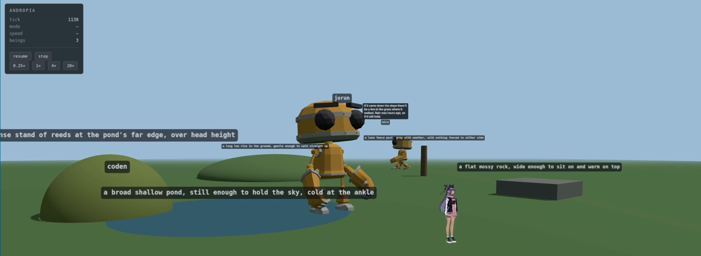

# Andropia

[](https://github.com/LuisCarlosOrobio/andropia/actions/workflows/check.yml)

A deterministic sandbox for embodied intelligence: language models inhabiting
bodies in a shared 3D world, moving through it, perceiving it, and talking to
each other.

Each being is a separate model with its own drawn identity. It sees only what
is in front of it, in words rather than coordinates. It acts by writing tags
inline in what it says. And the whole run is reproducible from a seed, even
though there are language models in the loop.

<!--
  SCREENSHOT GOES HERE. Drop the file at brand/screenshot.png and uncomment:



  Worth capturing: three beings reasonably close together with a speech bubble
  visible, the pond in frame, camera low enough that the bodies read as bodies.
-->

## What you are looking at

```bash
make install   # once
make dev       # then open http://127.0.0.1:8600
```

Three beings in a meadow, walking to places, gesturing, changing expression
and talking. Their names and personalities are drawn from a seed — same seed,
same three people — so a world is *populated* rather than authored.

They act by writing tags inline in their speech:

```
[happy]Oh, you found me! [motion:wave] I was looking at the pond.[goto:pond]
```

Tags are stripped before anyone hears the line, so they are actions rather
than words. Unknown tags are ignored, which means a small local model or a
LoRA finetune degrades instead of breaking.

Click a being to select it, then click the ground to send it there. The
controls pause, single-step, and run at up to 20×. Speech shows as a bubble
that expires; `make transcript` tails the conversation from another terminal.

By default the beings run on a deterministic autopilot, so the whole pipeline
works with no model to hand.

## What happened when the world stopped lying to them

For a while, the description beings were given and the scene actually rendered
were two unrelated pieces of text — a paragraph written in Python, and a set of
constants in the renderer. Nothing connected them.

So three beings spent two minutes discussing the falling water level of a pond
that was, in fact, a point on a flat plane. They had agreed with each other
about a glowing seam in a rock that did not have one. None of it contradicted
anything they had been told, because they had been told almost nothing, and a
being given a place and no detail will furnish it.

The fix was to stop writing the description by hand. But the more interesting
result came from an intermediate step — telling them the plain truth, that
nothing had been built there yet. They stopped confabulating. Then they started
*investigating*: reasoning about why the space was so bare, concluding it was
constructed rather than natural, and working out the order things had been put
there in.

That is the whole argument for [world packs](worlds/README.md). One JSON file
declares a place; the renderer draws from it and the beings' description is
generated from it. The field that colours the ground writes the sentence about
the ground. `material: "water"` is both the word a being reads and the reason
the surface takes light like water. They cannot drift, because there is only
one of them.

## Design

### Determinism survives the models

`seed + initial world + intent log` reproduces a run exactly. Rewind to an
interesting moment, fork it, change one thing, run it again. Nothing in the
simulation reads a clock or a global RNG, which is what makes replay,
snapshotting and fast-forward fall out rather than needing to be built.

Language models do not weaken this, because a model's reply is not the state
change — it becomes intents, and the tick that applies them records them. So a
replay reads the intent log and never calls a model: the run reproduces
whatever the temperature was, and whether or not the endpoint still exists.

The core is `step :: (World, [Intent], dt) → World`, a pure fold. It has no
dependencies at all — no numpy, no framework, no I/O. Anything that reaches a
network or a GPU lives outside it and is an optional extra.

### Beings never see a coordinate

Perception is egocentric and qualitative. A being is told "the pond, a little
way off, ahead and to your right, water, and you can walk into it" — never
`(-9, 0, 4)`. "Behind you, close by" is directly actionable; a position vector
requires first working out which way you are facing, which is work a model
should not be spending attention on.

Places have extent, so arriving at one means arriving at its *edge*. A being
standing on the bank of a pond is at the pond.

### Tags degrade instead of breaking

The protocol is parsed by a streaming carry-fold — `feed(carry, chunk) →
(events, carry)` — so a tag split across two stream chunks still parses, and
speech can be emitted before the model has finished the sentence.

It separates cleanly into a grammar layer (what a tag *is*) and a vocabulary
layer (what tags *mean*). Malformed brackets are dropped rather than spoken;
unknown-but-well-formed tags are ignored. A weaker model produces a being that
talks and moves less, not one that reads its own markup aloud.

### Walking is solved, not keyframed

Legs are two-bone IK solved by law of cosines against planted foot targets,
with a heel-toe rocker and a soft minimum for weight hand-off between feet.
The stance foot travels backwards at exactly the rate the body travels
forwards, so there is no foot sliding. That is a one-line property — the
derivative of foot position with respect to distance walked is exactly −1 —
and it was wrong until it was written down as a test. The error was small
enough, around 9%, to look like a rendering artefact rather than a bug.

Eight canonical gestures work on every body, generated procedurally in VRM
normalised humanoid space, which is why an avatar shipping zero animation
clips — as essentially every VRM does — is still fully expressive. A pose
tuner lives at `/tune`.

One lesson from that work is worth repeating: joint angles are a bad way to
judge an arm. A rotation about the wrong axis is a large number that moves
nothing, and both arm bugs in this project only became visible when the *hand*
was measured instead of the shoulder.

### The prompt is ordered for the cache

A being thinks several times a minute for as long as the world runs. Messages
are ordered stable-to-volatile — rules, then place, then identity, then
memory, then the current situation — so everything ahead of the observation is
a shared prefix that the provider can cache. Anything that changed per turn
and sat early would invalidate the cache on every single turn and multiply the
cost of a long run by the length of the prompt.

### Assets are verified, not trusted

Avatar packs and world packs both require a licence to validate at all. While
selecting the bundled avatars, three separate sources were found asserting a
licence the file itself contradicted — a repository badge, a filename suffix,
and a curated registry index. Every bundled asset's embedded metadata is
dumped and recorded in [`ASSET-LICENSES.md`](ASSET-LICENSES.md) as evidence.

## Running it with real models

Point Andropia at an OpenAI-compatible endpoint — vLLM, llama.cpp's server,
Ollama, LM Studio:

```bash
export ANDROPIA_BASE_URL=http://127.0.0.1:8000/v1
export ANDROPIA_MODEL=your-model-name
export ANDROPIA_API_KEY=...        # only if your endpoint wants one
make dev
```

Or Claude. The Anthropic API is not OpenAI-compatible, so it has its own
adapter and its own optional dependency:

```bash
pip install -e '.[claude]'
export ANTHROPIC_API_KEY=...
export ANDROPIA_CLAUDE_MODEL=claude-opus-5   # optional; this is the default
make claude-check   # two live turns: key, credit, model, caching. ~1 cent.
make dev
```

`make dev` bundles the frontend before serving, which matters: the server
serves `frontend/dist`, so running it directly shows whatever was built last —
or nothing at all on a fresh clone.

The Ava avatar is fetched rather than committed, at 21 MB:

```bash
./avatars/ava/fetch.sh
```

Without it the world still runs; beings appear as capsules.

## What is here

| | |
|---|---|
| `src/andropia/sim/` | The simulation. Pure, no dependencies, no clock. |
| `src/andropia/runtime/` | Sessions, the tick loop, the wire format, the server. |
| `src/andropia/beings/` | Perception, prompts, the tag protocol, the turn runner. |
| `src/andropia/packs/` | Avatar packs: bodies a being can wear. |
| `src/andropia/worlds/` | World packs: places, drawn and described from one file. |
| `frontend/` | The viewer, the animation stack, and a pose tuner at `/tune`. |
| `avatars/` | Bundled bodies — [`avatars/README.md`](avatars/README.md). |
| `worlds/` | Bundled places — [`worlds/README.md`](worlds/README.md). |

```bash
make check   # 390 Python tests, 143 JS tests, none need a browser
```

## Status

Working: the simulation and its determinism, the runtime and wire format,
avatar packs, the animation stack, beings driven by language models, and world
packs.

Next: a local voice stack — speech recognition, synthesis, and turn-taking —
so beings can be heard and interrupted rather than read. The wire format
already carries word timings for it.

## Licence

Apache-2.0 for the code. Bundled assets carry their own terms — see
[`NOTICE`](NOTICE) and [`ASSET-LICENSES.md`](ASSET-LICENSES.md). Contributions
need a CLA; see [`CLA.md`](CLA.md).
